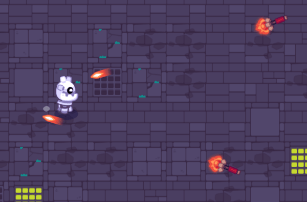

# Dodging enemy attacks

This demo shows how to code a dodge mechanic in an action game. It shows how to make the character move faster during the dodge and make them invincible. We reuse the hit and hurt box from the [HitBox and HurtBox demo](https://gdquest.github.io/godot-demos-2022/hitbox-hurtbox/).

To learn how this works, we invite you to open the `Player.gd` script and to look at the comments.
