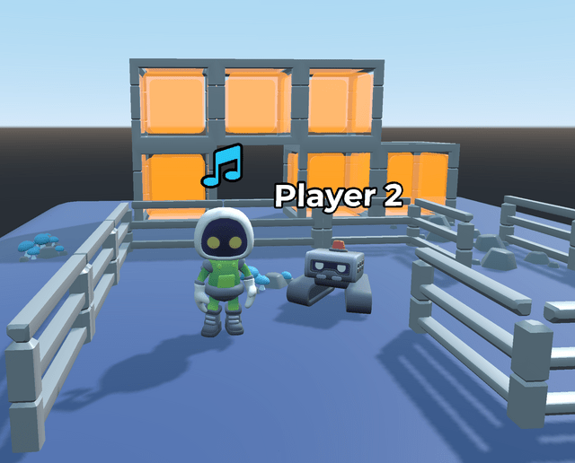

# New features in Godot 3.5

This collection of demos highlights some of the significant new features in Godot 3.5.

We made it along with our video dedicated to The Cool New Features in Godot 3.5 (coming soon, subscribe to [our channel](https://www.youtube.com/c/Gdquest) to know when it comes out).

This project requires Godot 3.5 to open.

It showcases:

1. The new navigation server with support for moving obstacles. The demos show it working both in 2D and 3D.
1. The new SceneTreeTween that allows you to create tweens without creating nodes.
1. The new `Label3D` node, which displays text as billboards or double-sided quads.
1. The new flow container for user interface, which is a bit like flexbox in CSS.
1. The physics interpolation feature, which allows you to lower the physics updates, save performance, yet get smooth motion.
1. The 2D gradient texture you can use for lights, particle placeholders, and masking.
1. The ability to align icons on buttons.
1. The use of property pinning on inherited scenes.
1. The text mesh resource to extrude 3D text.
1. And the theme type variations that allow you to use your global project theme and make variations of anything.
