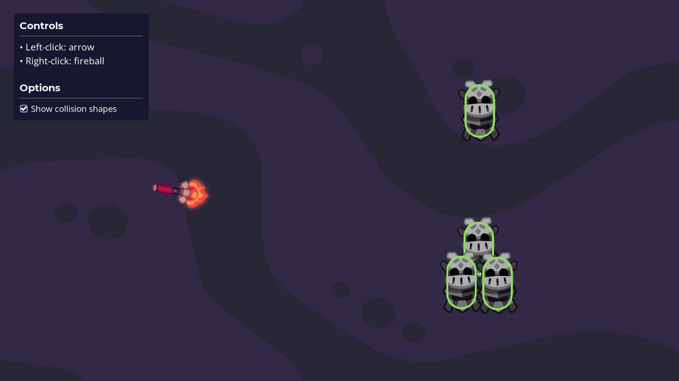

# Ranged attacks

This demo shows how to use hitboxes and hurtboxes to create ranged attacks. It shows both attacks that hit in a small area and explosions that can damage multiple enemies in a wide area.
 

